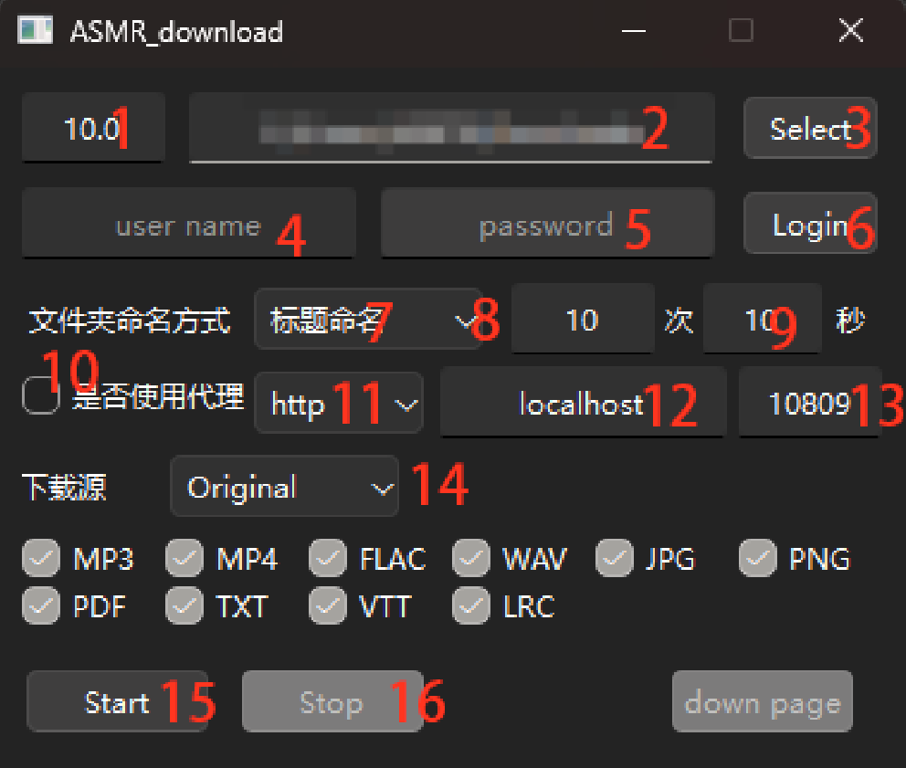

# 用于在ASMR.ONE中下载ASMR 现已支持 中文 英文 日语

## 使用说明

### 1# 在ASMR.ONE中创建账号，将喜欢/需要下载的作品打上（标记为想听）


### 2# 设置页面



``` text
1:   下载限速 单位MB/S 可使用小数或者整数
2\3：  设置下载路径 点击Select后在选择弹框中选择
4：  ASMR.ONE 账号
5：  ASMR.ONE 密码
6：  输入完成账号密码后 点击Login登录获取ASMR.ONE TOKEN
7：  设置文件夹命名方式 可选RJ号命名和作品名命名
8：  设置最大超时重试次数
9：  设置下载超时时间 单位秒
10:  是否使用网络代理（全局网络代理 包括下载）
11:  选择代理类型 http https socks5 socks4
12:  代理地址
13： 代理端口
14： 选择下载源，建议使用主站源，镜像源2可能会出现下载wav文件，但回传的是mp3文件（存疑，有issue提出）
15： 开始下载
16： 停止下载

※ 注意事项 1、6、7、8、12、13、14 设置修改即可保存
※ 文件格式选择 打勾则会下载 不打勾则会跳过下载 默认全选
※ VTT-视频文本轨道 LRC-基于纯文本的歌词专用格式
```

## 3# 下载完成后的作品会在ASMR.ONE标记为（在听）

## 4# ※※※ 数据库配置保持默认 否则会变得不幸